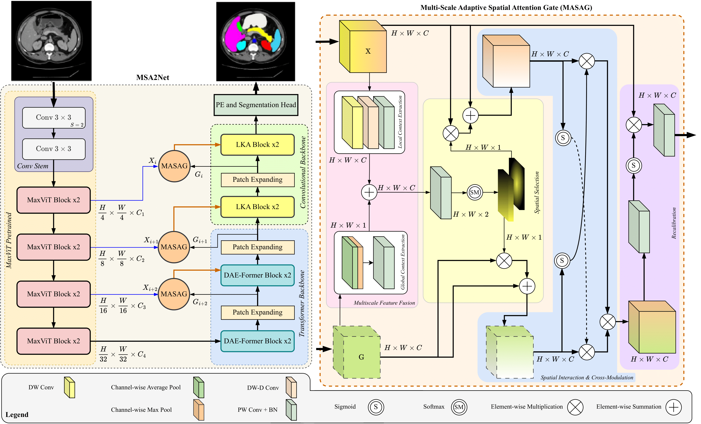

# MSA<sup>2</sup>Net: Multi-scale Adaptive Attention-guided Network for Medical Image Segmentation <br> <span style="float: right"><sub><sup>BMVC 2024</sub></sup></span>
[]()

Medical image segmentation involves identifying and separating object instances in a medical image to delineate various tissues and structures, a task complicated by the significant variations in size, shape, and density of these features. Convolutional neural networks (CNNs) have traditionally been used for this task but have limitations in capturing long-range dependencies. Transformers, equipped with self-attention mechanisms, aim to address this problem. However, in medical image segmentation it is beneficial to merge both local and global features to effectively integrate feature maps across various scales, capturing both detailed features and broader semantic elements for dealing with variations in structures. In this paper, we introduce MSA<sup>2</sup>Net, a new deep segmentation framework featuring an expedient design of skip-connections. These connections facilitate feature fusion by dynamically weighting and combining coarse-grained encoder features with fine-grained decoder feature maps. Specifically, we propose a Multi-Scale Adaptive Spatial Attention Gate (MASAG), which dynamically adjusts the receptive field (Local and Global contextual information) to ensure that spatially relevant features are selectively highlighted while minimizing background distractions. Extensive evaluations involving dermatology, and radiological datasets demonstrate that our MSA<sup>2</sup>Net outperforms state-of-the-art (SOTA) works or matches their performance.



## Updates

- **`20.07.2024`** | Accepted in BMVC 2024! 🥳

## Citation
```

```

## How to use

  ### Requirements
  
  - Ubuntu 16.04 or higher
  - CUDA 11.1 or higher
  - Python v3.7 or higher
  - Pytorch v1.7 or higher
  - Hardware Spec
    - A single GPU with 12GB memory or larger capacity (_we used RTX 3090_)

  ```
einops
h5py
imgaug
fvcore
MedPy
numpy
opencv_python
pandas
PyWavelets
scipy
SimpleITK
tensorboardX
timm
torch
torchvision
tqdm
  ```

 ### Model weights
  You can download the pretrained and learned weights in the following.
   Dataset   | Model | download link 
  -----------|-------|----------------
  ImageNet   | MaxViT small 224     | [Download](https://drive.google.com/file/d/1MaWFYadsYFEROLNvYG8hZAYnlGCkPLaN/view?usp=sharing)
   Synapse   | MSA<sup>2</sup>Net   | [Download](https://drive.google.com/file/d/19CwKKw18KYNNohFb7dFOOspQqmoQQ679/view?usp=sharing)

### Training and Testing

1) Download the Synapse dataset from [here](https://drive.google.com/uc?export=download&id=18I9JHH_i0uuEDg-N6d7bfMdf7Ut6bhBi).

2) Download the MaxViT small 224x224 pretrained weights [here](https://drive.google.com/file/d/1MaWFYadsYFEROLNvYG8hZAYnlGCkPLaN/view?usp=sharing) and then put it in the 'networks/merit_lib/networks.py' file for initialization.
3) Run the following code to install the Requirements.

    `pip install -r requirements.txt`

4) Run the below code to train the MSA<sup>2</sup>Net on the synapse dataset.
    ```bash
    python train.py --root_path ./data/Synapse/train_npz --test_path ./data/Synapse/test_vol_h5 --batch_size 20 --eval_interval 20 --max_epochs 700
    ```
    **--root_path**     [Train data path]

    **--test_path**     [Test data path]

    **--eval_interval** [Evaluation epoch]
 5) Run the below code to test the MSA<sup>2</sup>Net on the synapse dataset.
    ```bash
    python test.py --volume_path ./data/Synapse/ --output_dir ./model_out
    ```
    **--volume_path**   [Root dir of the test data]
        
    **--output_dir**    [Directory of your learned weights]
    
## Experiments

### Synapse Dataset
<p align="center">
  
  
</p>

### ISIC 2018 Dataset
<p align="center">
  
  
</p>

## References
- DAEFormer [https://github.com/mindflow-institue/DAEFormer]
- D-LKA Net [https://github.com/xmindflow/deformableLKA]
- SKNet [https://github.com/osmr/imgclsmob/tree/68335927ba27f2356093b985bada0bc3989836b1]
- FAT [https://github.com/qhfan/FAT]
